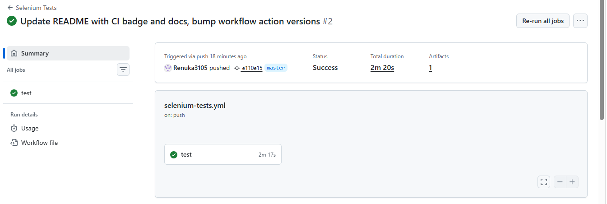
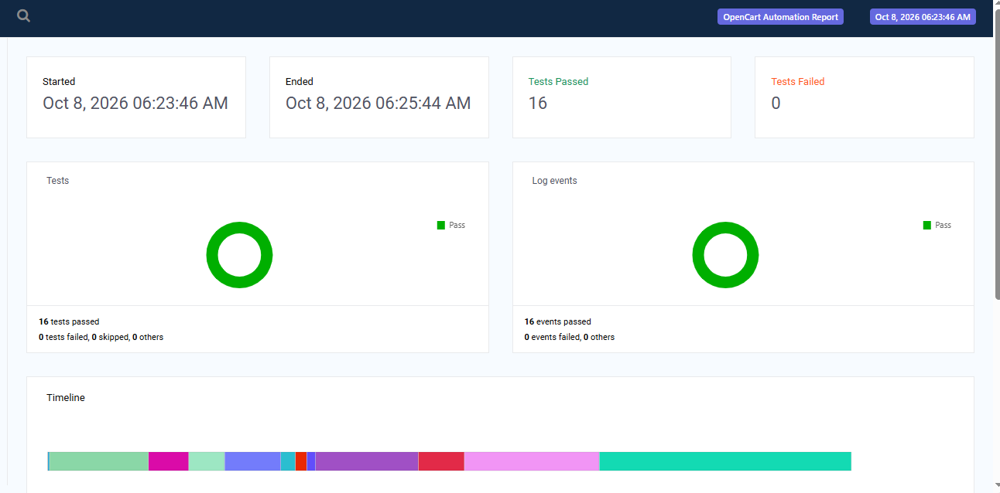

# 🛒 OpenCart Automation Framework


A scalable Selenium test automation framework for the OpenCart e-commerce application, built with Java, TestNG, Maven and the Page Object Model (POM). It supports data-driven testing, cross-browser and parallel execution, logging, reporting, and runs headless in a GitHub Actions CI pipeline.

---

## 📌 Features

- Page Object Model (POM) design pattern
- Selenium WebDriver 4 with Java 17
- TestNG with multiple suites (regression, cross-browser, parallel)
- Maven build management
- Data-driven testing using Apache POI (Excel)
- Cross-browser execution (Chrome, Edge, Firefox)
- Parallel execution using a ThreadLocal WebDriver
- Log4j2 logging
- Extent Reports with screenshots captured on failure
- Headless execution support (`-Dheadless=true`)
- CI with GitHub Actions: runs on every push and pull request, uploads reports as artifacts
- Runtime overrides for browser and application URL (`-Dbrowser`, `-DbaseUrl`)
- Configurable environment using a properties file

---

## 🛠 Tech Stack

| Technology | Version |
| --- | --- |
| Java | 17 |
| Selenium WebDriver | 4.31.0 |
| TestNG | 7.11.0 |
| Maven | 3.x |
| WebDriverManager | 6.1.0 |
| Apache POI | 5.4.1 |
| Log4j2 | 2.24.3 |
| Extent Reports | 5.1.2 |
| CI | GitHub Actions |

---

## 📂 Project Structure

```
OpenCartAutomationFramework
├── .github/workflows
│   └── selenium-tests.yml
├── src
│   ├── main
│   │   ├── java/com/opencart
│   │   │   ├── constants
│   │   │   ├── factory
│   │   │   ├── listeners
│   │   │   ├── pages
│   │   │   └── utilities
│   │   └── resources
│   │       ├── config.properties
│   │       ├── log4j2.xml
│   │       └── testdata.xlsx
│   └── test/java/com/opencart
│       ├── base
│       └── testcases
├── docs/screenshots
├── testng.xml
├── testng_crossbrowser.xml
├── testng_parallel.xml
└── pom.xml
```

---

## ✅ Automated Test Scenarios

16 automated tests (including data-driven iterations) covering:

- Home page verification
- User registration
- Valid login, invalid login, and logout
- Data-driven login using Excel
- Product search
- Add and remove products from the wishlist
- Add product to cart

---

## ▶️ Running the Tests

### Clone the repository

```
git clone https://github.com/Renuka3105/OpenCart-Selenium-Automation-Framework.git
cd OpenCart-Selenium-Automation-Framework
```

### Run the default suite

```
mvn clean test
```

### Run headless

```
mvn clean test -Dheadless=true
```

### Run a specific suite

```
mvn clean test -DsuiteXmlFile=testng_crossbrowser.xml
mvn clean test -DsuiteXmlFile=testng_parallel.xml
```

### Override browser or application URL

```
mvn clean test -Dbrowser=firefox
mvn clean test -DbaseUrl=https://your-opencart-url
```

(Don't pass `-Dbrowser` with the cross-browser suite, since it would override every browser in that suite.)

---

## 🔄 CI/CD with GitHub Actions

The workflow in `.github/workflows/selenium-tests.yml` runs automatically on every push and pull request to `master`, and can also be started manually from the **Actions** tab.

**What it does:**
1. Checks out the code and sets up Java 17 with Maven caching
2. Runs the TestNG suite in headless Chrome: `mvn clean test -Dheadless=true`
3. Uploads the Extent report, screenshots, logs and Surefire reports as a downloadable artifact (`test-reports`)



---

## 📊 Reports

After each run you get:

- Extent Report (HTML)
- TestNG / Surefire reports
- Log files
- Screenshots captured on test failure



---

## 📚 Design Patterns Used

- Page Object Model (POM)
- Factory pattern (`DriverFactory`)
- ThreadLocal driver for thread-safe parallel execution
- Utility classes for config, Excel data, and random test data

---

## 👩‍💻 Author

**Renuka Chowdary Muppana**

GitHub: [Renuka3105](https://github.com/Renuka3105)

---

## ⭐ Future Enhancements

- Docker integration
- Selenium Grid
- Allure reports
- Database validation
- API integration
- Jenkins pipeline
